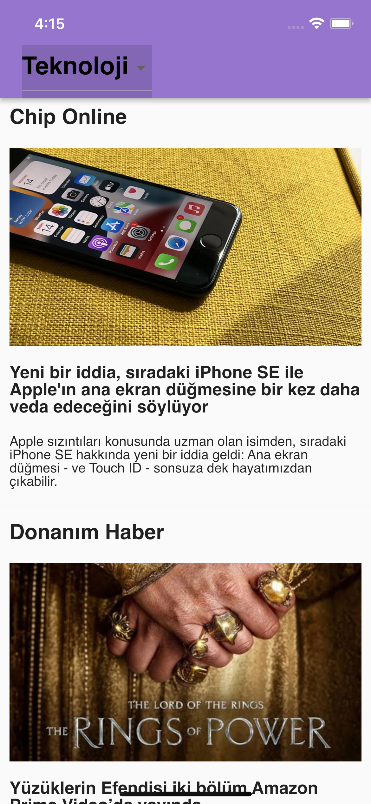

# News api with Flutter

Bir api üzerinden güncel haberleri çekip Dio ile bağladım. Haber kategorilerine atılan request'lerde url query/tag'lerini DropdownButton'a liste olarak verdim ve böylelikle seçilen kategoriye ait haber verilerini güncellenerek tek bir sayfa içerisinde gösterdim. Tek sayfa bir proje bile olsa Provider kullanmayı tercih ettim. Şahsen kullanımını vanilla state'den daha kolay ve işlevsel bulduğum için tercih ediyorum. 

Haber satırlarının üzerine tıklandığında haber kaynağında urllauncher aracılığıyla yönlendirerek kullanıcının haber detaylarına ulaşmasını sağladım. onTap metodunu tüm cell için geçerli halde tuttum çünkü gelen veriler daha çok özet niteliğinde ve kullanıcının bir sonraki sayfaya gitmesi yönünde kurgulanmış.

   

  
